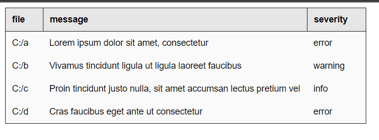

# Solid Table


Solid Table is an efficient reactive table component that gives you freedom.



## Installation

      npm install --save solid-simple-table

## Usage

```js
import { render } from "solid-js/web"

import { SimpleTable } from "solid-simple-table"
import type { SortDirection } from "solid-simple-table"

const rows = [
  { file: "C:/a", message: "Lorem ipsum dolor sit amet, consectetur", severity: "error" },
  { file: "C:/b", message: "Vivamus tincidunt ligula ut ligula laoreet faucibus", severity: "warning" },
  { file: "C:/c", message: "Proin tincidunt justo nulla, sit amet accumsan lectus pretium vel", severity: "info" },
  { file: "C:/d", message: "Cras faucibus eget ante ut consectetur", severity: "error" },
]

function MyTable() {
  return <SimpleTable rows={rows} />
}

render(() => <MyTable />, document.getElementById("app"))
```

For other examples see the demo folder.

## API

```ts

<SimpleTable
  // rows
  rows: Array<Row<K, V>>

  // Optional props:

  // columns

  // construct columns based on this row
  // (Defaults to 0 first row)
  representitiveRowNumber?: number

  // manually provided columns
  columns?: Array<Column<K, V>>


  // renderers
  headerRenderer?(column: Column): string | Renderable
  bodyRenderer?(row: Row, columnID: K): string | Renderable

  // styles
  style?: AnyObject
  className?: string

  // sort options
  defaultSortDirection?: NonNullSortDirection<K>
  rowSorter?(rows: Array<Row>, sortDirection: NonNullSortDirection<K>): Array<Row>


  // accessors

  /**
    set to true if you want column, row, and cell accessors
    @default false
  */
  accessors?: boolean

  /** a function that takes row and returns string unique key for that row
    @default {defaultGetRowID}
  */
  getRowID?(row: Row): string

/>;
```

In which:

```ts
// util types
export type AnyObject = Record<string, any>
export type Renderable = any

// row and column types
export type Key = string
export type Row<K extends Key = string, V = any> = Record<K, V>

export type Column<K extends Key = string, V = any> = {
  key: K
  label?: string
  sortable?: boolean
  onClick?(e: MouseEvent, row: Row<K, V>): void
}

/** Sort direction.
  It is a tuple:
  @columnID is the key used for sorting
  @type is the direction of the sort
*/
export type NonNullSortDirection<K = Key> = [columnID: K, type: "asc" | "desc"]
export type SortDirection<K = Key> = NonNullSortDirection<K> | [columnID: null, type: null]
```

## License

This package is licensed under the terms of MIT License. It was converted from [sb-react-table](https://github.com/steelbrain/react-table/tree/2f8472960a77ca6cf2444c392697772716195bf4).
